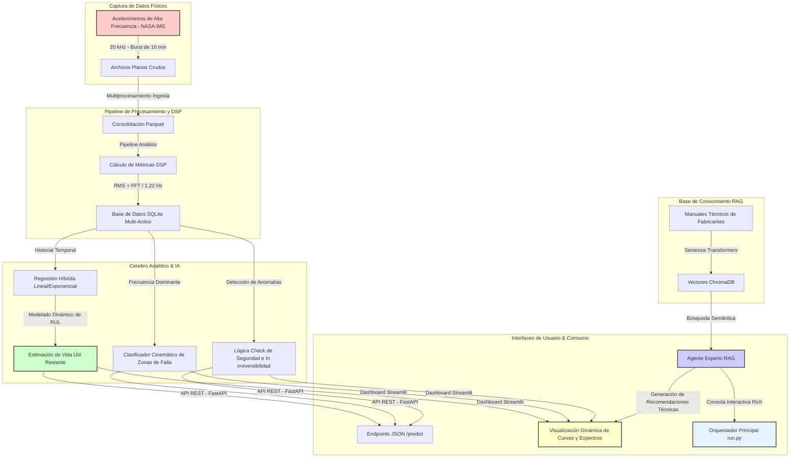

# 🏭 FactoryGuard AI: Plataforma Predictiva de Vida Útil (RUL) Industrial

[](https://www.python.org/)
[](https://fastapi.tiangolo.com/)
[](https://www.docker.com/)
[](https://www.trychroma.com/)
[](LICENSE)
[](scripts/run_qa.py)

**FactoryGuard AI** es un sistema inteligente de grado industrial para la monitorización de condiciones, el diagnóstico temprano de fallas y la predicción de vida útil remanente (**RUL - Remaining Useful Life**) de rodamientos de alta velocidad, operando bajo una arquitectura híbrida de procesamiento digital de señales (DSP), inteligencia artificial agentiva y modelos de regresión física adaptativa.

El sistema utiliza como núcleo analítico los históricos de vibraciones del prestigioso **NASA IMS Bearing Dataset** (University of Cincinnati), integrando almacenamiento multi-activo estructurado, generación aumentada por recuperación (**RAG**) para soporte de mantenimiento predictivo, alertas automatizadas y un dashboard web interactivo de simulación.

---

## 🌐 Acceso a la Aplicación Web (Producción en Vivo)

Para evaluadores, reclutadores o clientes que deseen interactuar directamente con la plataforma sin necesidad de configuración local, el sistema se encuentra completamente desplegado y operativo en:

👉 **[FactoryGuard AI - Streamlit Web Application](https://factoryguard-api-wn3yhqy8mcpeu2jjfyp7uy.streamlit.app/)**

### 🎮 Guía Rápida para la Interacción Web
Una vez ingreses al enlace, puedes experimentar las dos modalidades principales de la plataforma:

1. **Modo 1: Datos Reales de la NASA (IMS Bearing Dataset)**
   * **Objetivo:** Analizar el ciclo de vida real de un rodamiento bajo carga constante hasta el fallo catastrófico.
   * **Instrucciones:** Selecciona un rodamiento en la barra lateral (p. ej., *Rodamiento 1*), y ajusta el **Desplazamiento Temporal (Días de Operación)** usando el deslizador. Observa cómo la curva de tendencia RMS se actualiza en tiempo real, identificando automáticamente la transición microscópica de estado (Sano $\rightarrow$ Alerta Incipiente $\rightarrow$ Alerta Avanzada $\rightarrow$ Crítico) y proyectando los días de vida útil remanente (RUL) mediante regresión adaptativa.

2. **Modo 2: Simulador Interactivo de Inyección de Fallas Físicas**
   * **Objetivo:** Simular anomalías y evaluar instantáneamente la respuesta de los algoritmos DSP y de IA.
   * **Instrucciones:**
     * Activa el interruptor **"Habilitar Simulador de Inyección de Fallas"** en la barra lateral.
     * Modifica parámetros operativos críticos como las **RPM del motor** y el **Ruido de Fondo (Acelerómetro)**.
     * Selecciona e incrementa la **severidad del defecto** específico que deseas inyectar (pistas externa/interna `BPFO/BPFI`, giro de elemento rodante `BSF` o jaula `FTF`).
     * Visualiza instantáneamente cómo reacciona el espectro FFT en el gráfico interactivo de Plotly, mostrando los picos de armónicos exactos calculados dinámicamente mediante las ecuaciones cinemáticas cinéticas.

3. **Asistente Experto RAG (Chat Inteligente)**
   * **Objetivo:** Consultar manuales y directrices de mantenimiento predictivo con IA.
   * **Instrucciones:** Dirígete a la pestaña de **Chat Experto RAG** en el menú de navegación de la barra lateral. Realiza consultas técnicas conversacionales libres (p. ej., *"¿Qué es el indicador RMS?"*, *"¿Cuáles son las ecuaciones de BPFO y BPFI?"* o *"¿Qué acciones de mantenimiento preventivo debo tomar si se activa una alerta crítica?"*). El chatbot te responderá en tiempo real utilizando la base de conocimiento cargada en ChromaDB, con soporte de fórmulas en LaTeX y planes de acción profesionales.

---

## 📈 Impacto de Negocio & ROI (Perspectiva Ejecutiva)

En la industria pesada y de manufactura avanzada, la falla no planificada de un único rodamiento en un motor crítico puede detener líneas de producción enteras, generando costos directos de inactividad que, según estimaciones consolidadas de la industria, pueden superar las decenas de miles de dólares por hora dependiendo del sector y la criticidad del activo, además de daños secundarios a otros activos y riesgos de seguridad para los operarios.

**FactoryGuard AI** transforma el mantenimiento de un paradigma reactivo o preventivo estándar a un enfoque **predictivo optimizado por datos**:
* **Reducción de Paradas No Planificadas:** Permite programar el reemplazo del componente dañado de manera oportuna con días u horas de antelación, sincronizándolo con ventanas estándar de producción.
* **Extensión de la Vida Útil del Activo:** Evita el reemplazo prematuro de rodamientos saludables gracias al cálculo de RUL adaptativo en tiempo real basado en la tendencia de degradación física real.
* **Trazabilidad Multi-Activo:** Permite centralizar la salud vibratoria de múltiples motores de planta en una única base de datos integrada de alta velocidad.
* **Acceso Inmediato a Conocimiento Experto:** El agente RAG integrado traduce métricas físicas complejas en planes de acción y procedimientos estándar de seguridad extraídos de manuales técnicos reales, acelerando la toma de decisiones por parte del personal de planta.

---

## 📊 Arquitectura de Datos y Microservicios

El siguiente diagrama ilustra el flujo de datos unificado, desde la captura del sensor físico hasta la visualización y las recomendaciones del asistente RAG:



---

## 🛠️ Arquitectura Técnica & Bloques de Ingeniería

El proyecto destaca por un riguroso desarrollo de software científico estructurado en módulos desacoplados de alta cohesión:

### 1. Pipeline DSP (Procesamiento Digital de Señales)
* **Supresión Automática de DC Offset:** Evita distorsiones espectrales forzando media cero en las ráfagas antes del análisis espectral.
* **Estimación Energética RMS:** Indicador primario de severidad que evalúa la amplitud del vector energético temporal.
* **FFT de Alta Resolución:** Descomposición espectral de la ráfaga de vibraciones con una resolución matemática de $1.22\text{ Hz}$ sobre una frecuencia de muestreo de $20,000\text{ Hz}$ y una longitud de ventana de $16,384$ muestras.
* **Detección Automática de Microcrack:** Algoritmo optimizado mediante la evaluación dinámica del gradiente del logaritmo del RMS sobre ventanas móviles para identificar el momento preciso de la transición microscópica (inflexión) a la Fase II de degradación.

### 2. Motor de RUL Híbrido
* Se adapta dinámicamente al estado de salud de la maquinaria. Realiza un ajuste de curvas simultáneo mediante **Regresión Lineal Simple** y **Regresión Log-Exponencial** con origen desplazado dinámicamente. El sistema selecciona en tiempo real el modelo de menor error cuadrático medio (RMSE) para proyectar cuándo el rodamiento cruzará el umbral crítico de falla irreversible ($0.25\text{ g}$).

### 3. Válvula de Seguridad de Irreversibilidad Física
* El daño mecánico es acumulativo y físicamente no puede autorepararse. El sistema incluye una lógica estricta que almacena e incrementa la variable `max_rms_historico`, evitando caídas momentáneas en los reportes de severidad del rodamiento por factores transitorios como la disipación térmica o reasentamientos de lubricación.

### 4. Filtro Inteligente de Apagado (Out-of-Service)
* Si el RMS cae por debajo de $0.01\text{ g}$ (ruido base instrumental), el motor se identifica como "Fuera de Servicio", deteniendo los algoritmos de pronóstico para evitar que cálculos con datos planos sesguen el histórico.

### 5. Agente Conversacional RAG e Inteligencia Artificial
* Cuenta con una colección vectorial persistente en **ChromaDB** que aloja manuales técnicos y normativas industriales. Ante cualquier estado de alarma del rodamiento, el agente recupera semánticamente los procedimientos operativos estandarizados (SOP) y genera planes detallados de acción.

---

## 📚 Fundamentos Físicos & Reporte Técnico Detallado

Para aquellos evaluadores, ingenieros o consultores técnicos interesados en profundizar en los modelos matemáticos, cinemáticas físicas de rodamientos (fórmulas de paso de bolas BPFO, BPFI, BSF, FTF), procesamiento de señales mediante transformadas de Hilbert, y análisis cinemático, se encuentra disponible un reporte exhaustivo e independiente redactado por nuestro especialista:

👉 **[Domain AI Expert Report: Fundamentos Físicos del Diagnóstico de Rodamientos por Vibraciones](docs/domain_expert_report.md)**

---

## 🚀 Simulador Interactivo e Interfaces de Usuario

### 1. Dashboard Web de Simulación (Streamlit)
El dashboard se ha diseñado como un **Interactive Playground de Alto Nivel**. Además de visualizar de manera dinámica la curva de degradación y el espectro de frecuencias del dataset real de la NASA, incluye un sofisticado **Simulador de Inyección de Fallas**:
* **Controles Interactivos:** Permite al usuario actuar sobre las variables de la máquina (RPM, nivel de ruido espectral blanco instrumental).
* **Inyección de Defectos Físicos:** Inyecta anomalías en zonas mecánicas específicas (pistas interna/externa, elementos rodantes, jaula) aplicando directamente las ecuaciones cinemáticas teóricas de fallas de rodamientos.
* **Visualización Inmediata:** Observa instantáneamente cómo reacciona el espectro FFT en tiempo real con sus respectivos picos harmónicos teóricos y cómo se altera el diagnóstico del agente RAG.

### 2. Orquestador de Consola e Informes de Consola (Rich CLI)
El proyecto cuenta con un orquestador principal interactivo por terminal (`run.py`) que utiliza la librería **Rich** para mostrar paneles informativos a reclutadores o clientes. Este orquestador permite realizar el flujo de trabajo completo:
* Consultar estado en tiempo real recalculando el RUL de los activos registrados.
* Lanzar demostraciones guiadas paso a paso del dataset real de la NASA mostrando la evolución cíclica (Sano $\rightarrow$ Incipiente $\rightarrow$ Alerta Avanzada $\rightarrow$ Crítica).
* Consultar el agente conversacional RAG desde el terminal.
* Generar automáticamente detallados informes ejecutivos en PDF de calidad corporativa usando **ReportLab**.

---

## 📦 Instalación y Guía de Inicio Rápido

### Requisitos previos
* Python 3.12 o 3.13
* SQLite3

### 1. Clonar el repositorio e instalar dependencias
```bash
git clone https://github.com/AnGuzC74/factoryguard-api.git
cd factoryguard-api
python3 -m venv .venv
source .venv/bin/activate
pip install -r requirements.txt
```

### 2. Ejecutar la Consola Interactiva (Orquestador CLI)
Inicia la consola visual con opciones completas para demostraciones:
```bash
python run.py
```
*Tip: Selecciona la opción **"D"** en el menú para experimentar la demostración interactiva que reproduce la falla real paso a paso con cálculos de RUL y el agente RAG integrados.*

### 3. Lanzar el Dashboard Web Interactivo
Inicia el servidor local de Streamlit para acceder al simulador de inyección de fallas en tu navegador:
```bash
streamlit run src/app/dashboard.py
```
Luego navega a `http://localhost:8501` en tu navegador.

### 4. Lanzar la API REST en Segundo Plano
La API cuenta con endpoints para predecir RUL a partir de archivos de telemetría y generar PDFs dinámicos:
```bash
python src/api/main.py
```
Accede a la documentación auto-generada e interactiva (Swagger UI) en `http://localhost:8000/docs`.

### 5. Ejecutar la Suite de Pruebas Unitarias (QA)
Para validar la estabilidad del sistema, robustez matemática de los modelos de pronóstico y correcto funcionamiento de las tuberías DSP:
```bash
PYTHONPATH=. pytest src/tests
```

---

## 🛠️ Stack Tecnológico

* **Lenguaje:** Python 3.12 / 3.13
* **Procesamiento de Señal (DSP):** NumPy, SciPy (Transformada de Hilbert y FFT)
* **Ingeniería de Características y Datos Columnares:** Polars
* **Base de Datos:** SQLite3, ChromaDB (Vector Store)
* **Modelado Predictivo (Prognosis):** Regresiones adaptativas robustas polinomiales y exponenciales (mínimos cuadrados)
* **Visualización Interactiva:** Streamlit, Plotly
* **Framework de API:** FastAPI, Uvicorn
* **Generación de Reportes corporativos:** ReportLab PDF, Rich (Terminal CLI)
* **Garantía de Calidad (QA):** Pytest (77% de cobertura en el núcleo físico/DSP `src/core/dsp.py` y 17% de cobertura global verificada mediante `pytest-cov`)
